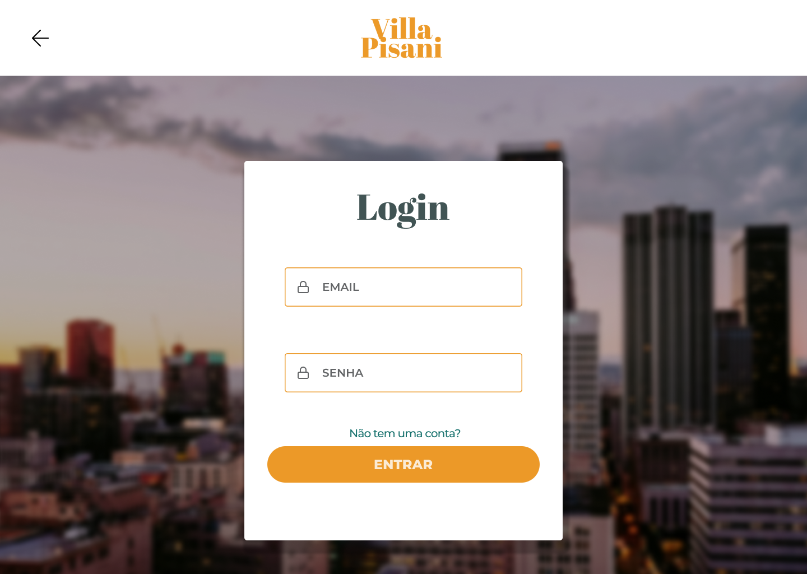
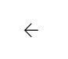

## Layout sugerido

<!-- Image -->

## Relacionamentos com outras interfaces

<!-- Image dos redirecionamento -->

 
 
 

## Campos

| Numero | Nome  | Descrição        | Valores Validos          | Formato        | Tipo          | Restrições                                                              |
| ------ | ----- | ---------------- | ------------------------ | -------------- | ------------- | ----------------------------------------------------------------------- |
| 01     | Email | Email do usuario | Caracteres Alfanumericos | Caixa de texto | String(email) | Email valido                                                            |
| 02     | Senha | Senha do usuario | Caracteres Alfanumericos | Caixa de texto | String        | Ter pelo menos 6 caracteres uma letra maiuscula, um símbolo e um numero |

# Comandos

| Numero | Nome      | Ação                             | Restrição              |
| ------ | --------- | -------------------------------- | ---------------------- |
| 01     | Entrar    | Redirecionar para a home interna | Email e senha corretos |
| 02     | Voltar    | Redirecionar para a home         | Nenhuma                |
| 03     | Sem conta | Redirecionar para a registro     | Nenhuma                |
