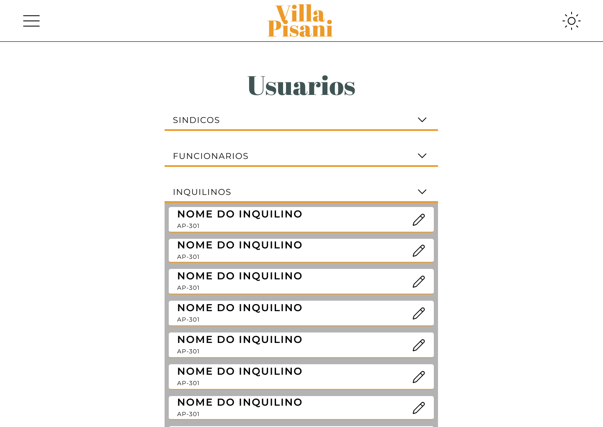
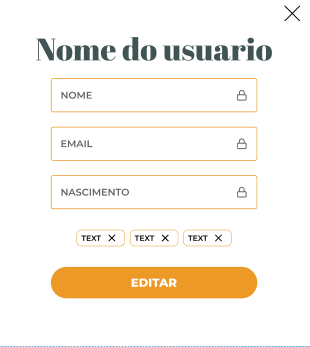

## Layout sugerido

## Relacionamentos com outras interfaces
## Campos

| Número | Nome            | Descrição                                    | Valores Válidos         | Formato       | Tipo          | Restrições                          |
|--------|-----------------|----------------------------------------------|-------------------------|---------------|---------------|-------------------------------------|
| 01     | Nome            | Nome do usuário                             | Caracteres Letras       | Caixa de texto | String        | Maior que 10 caracteres            |
| 02     | Email           | Email do usuário                            | Caracteres Alfanuméricos | Caixa de texto | String (email) | Email válido                       |
| 03     | Data Nascimento | Data de nascimento do usuário               | Data                    | Caixa de data  | Date          | Ter pelo menos dois anos           |
| 04     | Cargos          | Cargos que definem o que o usuário pode acessar | manager, inhabitant, employee | Caixa de seleção | String | Obrigatório                |

# Comandos
| Numero  | Nome               | Ação                                    | Restrição        |
|---------|--------------------|-----------------------------------------|------------------|
| 01        |   Dropbox        | Mostra o conteudo dropbox               |Não se aplica    |
| 02        |   Usuario btn    | Abri o modal                            |Não se aplica     |
