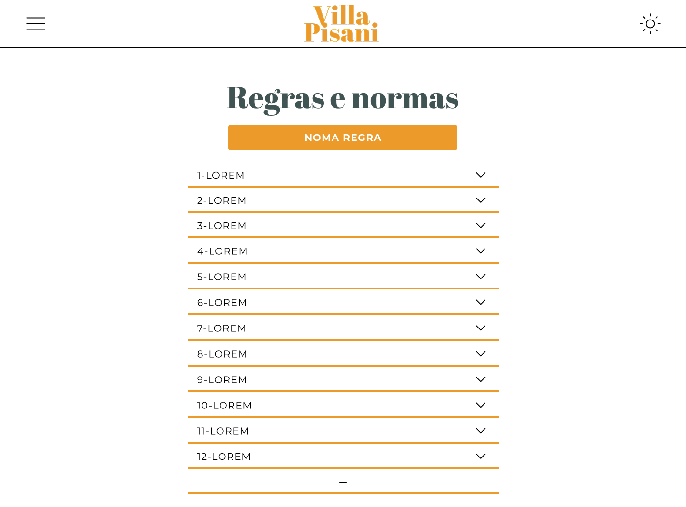
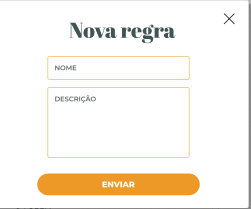

## Layout sugerido

## Campos

| Numero | Nome        | Descrição                 | Valores Validos          | Formato        | Tipo   | Restrições             |
| ------ | ----------- | ------------------------- | ------------------------ | -------------- | ------ | ---------------------- |
| 01     | Nome/Titulo | Nome que descreve a regra | Caracrees alfa numericos | Caixa de texto | String | Maior que 5 caracteres |
| 02     | Descrição   | Descrição da regra        | Caracrees alfa numericos | textarea       | String | Nenhuma                |

# Comandos

| Numero | Nome           | Ação                                                                               | Restrição |
| ------ | -------------- | ---------------------------------------------------------------------------------- | --------- |
| 01     | Abri modal     | Abri o modal referente a criar uma nova regra                                      | Nenhuma   |
| 02     | Abri descrição | clickar na seta abre a descrição regra, equando ela ja esta aberta clickar a fecha | Nenhuma   |
