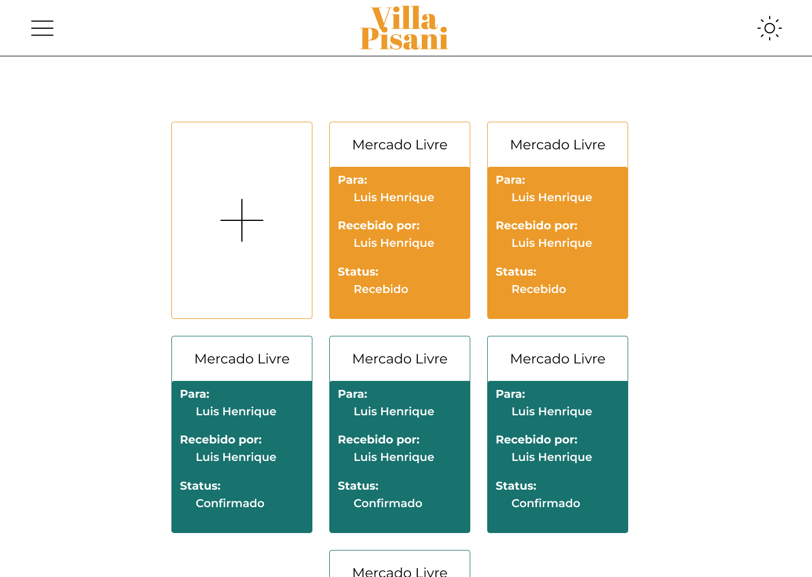
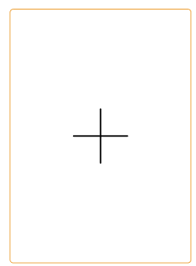

## Layout sugerido

## Relacionamentos com outras interfaces

## Campos

| Numero | Nome            | Descrição                     | Valores Validos | Formato        | Tipo   | Restrições                    |
| ------ | --------------- | ----------------------------- | --------------- | -------------- | ------ | ----------------------------- |
| 01     | Nome da entrega | Nome do emisario da emcomeda  | Alfabetos alfa  | caixa de texto | String | Maior ou igual a 3 caracteres |
| 02     | Rementente      | Nome do remetende da encomeda | Alfabetos alfa  | caixa de texto | String | Maior ou igual a 3 caracteres |

# Comandos

| Numero | Nome          | Ação                                             | Restrição |
| ------ | ------------- | ------------------------------------------------ | --------- |
| 01     | criar entrega | Abri o modal para registra uma nova encomenda    | Nenhuma   |
| 02     | abri entrefa  | Abri uma nova pagina com mais detales da entrega | Nenhuma   |
