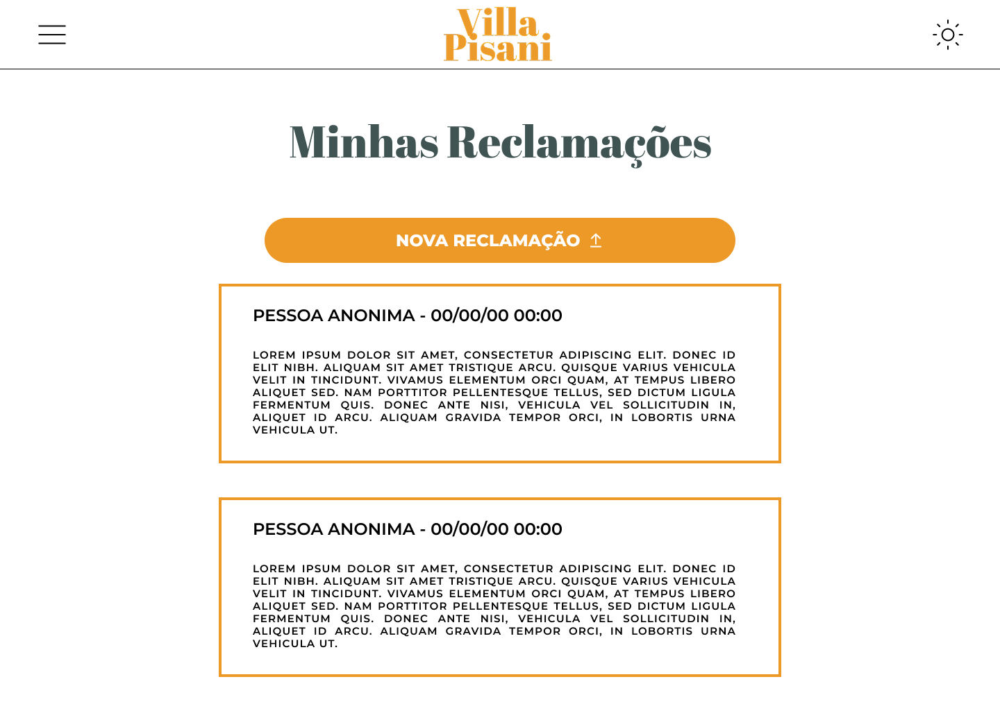
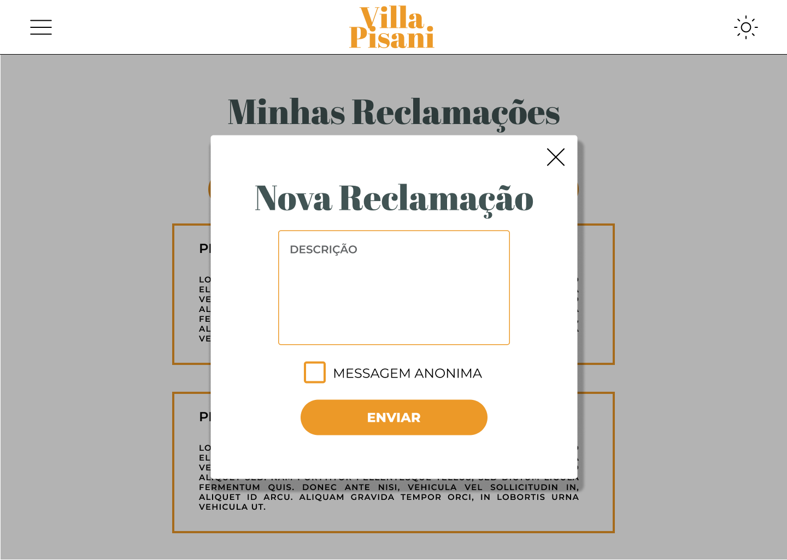

## Layout sugerido

<!-- Image -->

.

.

## Relacionamentos com outras interfaces

<!-- Image dos redirecionamento -->

Relacionamento com o layout seguinte da Ouvidoria

 

# Comandos

| Numero | Nome            | Ação                                          | Restrição |
| ------ | --------------- | --------------------------------------------- | --------- |
| 01     | Nova Reclamação | Redirecionar para segundo layout da Ouvidoria | Nenhuma   |
