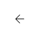

## Layout sugerido
<!-- Image -->

## Relacionamentos com outras interfaces
<!-- Image dos redirecionamento -->
 
 
 

## Campos

| Numero  | Nome               | Descrição                                    | Valores Validos         | Formato        | Tipo          | Restrições    |
|---------|--------------------|----------------------------------------------|-------------------------|----------------|---------------|---------------|
|    01   | Nome               | Nome do usuario                              | Caracteres Letras       | Caixa de texto | String        | Maior que 10 caracteres |
|    02   | Email              | Email do usuario                             | Caracteres Alfanumericos| Caixa de texto | String(email) | Email valido  |
|    03   | Data Nascimento    | Data Nasciment do usuario                    | Data                    | Caixa de Data  | Date          | Ter pelo menos dois anos|
|    04   | Senha              | Senha do usuario                             | Caracteres Alfanumericos| Caixa de texto | String        | Ter pelo menos 6 caracteres uma letra maiuscula, um símbolo e um numero  |
|    05   | Comfirma senha     | Senha do usuario                             | Caracteres Alfanumericos| Caixa de texto | String        | Ser igual a senha  |

# Comandos
| Numero  | Nome               | Ação                                    | Restrição              |
|---------|--------------------|-----------------------------------------|------------------------|
|   01    |  Entrar            | Redirecionar para a home interna        | Email e senha corretos |  
|   02    |  Voltar            | Redirecionar para a home                | Nenhuma                |  
|   03    |  Com conta         | Redirecionar para a login               | Nenhuma                |  